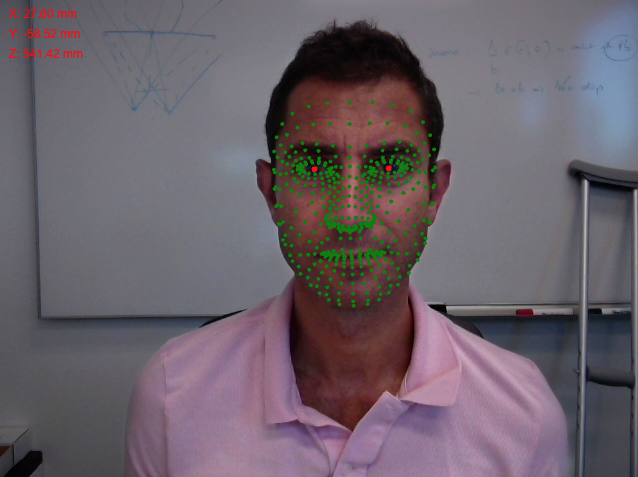

# Face Pose Estimation

This project demonstrates how to use TensorFlow.js and the Face Landmarks Detection model to estimate the pose of a viewer's face in front of a webcam and display the detected landmarks on a video feed.

## Features

- Real-time face pose estimation using a webcam
- Display of face landmarks on a video feed
- Calculation of the average x, y, and z coordinates for left and right eyes

